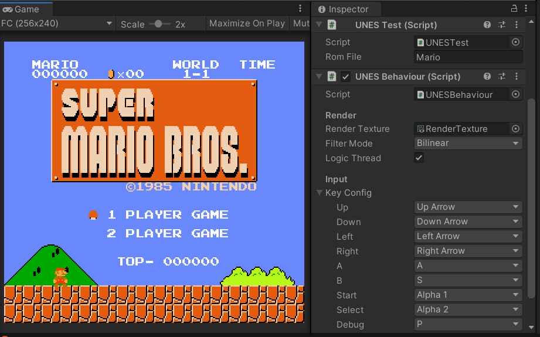

# UNES

<div align="center">    

</div>


`UNES` 是一个在 `Unity` 环境中运行 `Nintendo Entertainment System` 任天堂红白机游戏 `*.nes` 文件的模拟器插件，该项目基于 [Emulator.NES](https://github.com/Xyene/Emulator.NES) 实现，通过 `Unity` 实现跨平台。


[](https://github.com/ls9512/UNES/releases)


[](https://996.icu)


<!-- vscode-markdown-toc -->
* 1. [开始](#)
* 2. [加载](#-1)
	* 2.1. [Resources 加载](#Resources)
	* 2.2. [FileStream 加载](#FileStream)
* 3. [配置](#-1)
	* 3.1. [Filter Mode](#FilterMode)
	* 3.2. [Logic Thread](#LogicThread)
	* 3.3. [Input Config](#InputConfig)
* 4. [输入](#-1)
* 5. [API](#API)
	* 5.1. [Boot](#Boot)
	* 5.2. [Save](#Save)
	* 5.3. [Load](#Load)
* 6. [Mapper](#Mapper)
* 7. [问题](#-1)

<!-- vscode-markdown-toc-config
	numbering=true
	autoSave=true
	/vscode-markdown-toc-config -->
<!-- /vscode-markdown-toc -->

##  1. <a name=''></a>开始
* 1.在场景中新建或选择一个 `GameObject` 并添加 `UNESBehaviour` 组件。
* 2.新建一个 `RenderTexture` 用于渲染游戏画面。
* 3.使用任何你想要的方式在游戏中显示 `RenderTexture` 文件。
* 4.使用默认的输入方式或者按需实现自定义输入。
* 5.按需实现 `*.nes` 文件的加载获取 `byte[]` 格式数据。
* 6.调用 `UNESBehaviour.Boot(byte[] romData)` 接口启动游戏。

##  2. <a name='-1'></a>加载
###  2.1. <a name='Resources'></a>Resources 加载
如果需要使用 `Resources.Load()` 接口来加载ROM文件，则需要注意将 `.nes` 扩展名更改为 `.bytes`，然后使用如下方式加载：
``` csharp
var bytes = Resources.Load<TextAsset>(romPath).bytes;
UNES.BootRom(bytes);
```
###  2.2. <a name='FileStream'></a>FileStream 加载
如果使用加载原始文件字节流的方式，直接调用 `UNESBehaviour.Boot(byte[] romData)` 接口即可。

##  3. <a name='-1'></a>配置
###  3.1. <a name='FilterMode'></a>Filter Mode
游戏画面渲染的过滤模式：
|模式|描述|
|-|-|
|Point|纹理像素近距离变得块状。|
|Bilinear|双线性双线性滤波-将纹理样本平均。|
|Trilinear|三线性三线性过滤-对纹理样本进行平均，并在mipmap级别之间进行混合。|

详细解释可参考 [FilterMode](https://docs.unity3d.com/ScriptReference/FilterMode.html)

###  3.2. <a name='LogicThread'></a>Logic Thread
如果打开 `Logic Thread` 选项，则 `CPU` 和 `PPU` 部分的模拟计算会由子线程执行，Unity 主线程只负责读取状态数据刷新游戏画面，可显著提高帧数。

###  3.3. <a name='InputConfig'></a>Input Config
自定义原生按键所对应的键盘物理按键。

##  4. <a name='-1'></a>输入
默认配置操控方式：
|原生按键|操作按键|
|-|-|
|Start|Num1|
|Select|Num2|
|Up|Up Arrow|
|Down|Down Arrow|
|Left|Left Arrow|
|Right|Right Arrow|
|A|A|
|B|S|

##  5. <a name='API'></a>API
###  5.1. <a name='Boot'></a>Boot
以任何方式获取原始ROM文件的字节数组格式以供模拟器启动：
``` csharp
public void Boot(byte[] romData);
```

###  5.2. <a name='Save'></a>Save
模拟器本身只提供当前运行状态的数据，而不提供数据文件的持久化实现。需要自行实现存档数据的保存。
``` csharp
public byte[] GetSaveData();
```

###  5.3. <a name='Load'></a>Load
以任何方式获取存档文件数据以供模拟器恢复游戏进度：
``` csharp
public void LoadSaveData(byte[] saveData);
```

##  6. <a name='Mapper'></a>Mapper
NES 存在众多 Mapper 扩展格式，本项目实现的中已经实现部分，理论上可以支持大部分常见游戏。
|||
|-|-|
|0|[NROM](http://bootgod.dyndns.org:7777/search.php?ines=0)|
|1|[MMC1](http://bootgod.dyndns.org:7777/search.php?ines=1)|
|2|[UxROM](http://bootgod.dyndns.org:7777/search.php?ines=2)
|3|[CNROM](http://bootgod.dyndns.org:7777/search.php?ines=3)|
|4|[MMC3](http://bootgod.dyndns.org:7777/search.php?ines=4)|
|7| [AxROM](http://bootgod.dyndns.org:7777/search.php?ines=7)|
|9|[MMC2](http://bootgod.dyndns.org:7777/search.php?ines=9) (*Mike Tyson's Punch-Out!!*)|
|10|[MMC4](http://bootgod.dyndns.org:7777/search.php?ines=10)|
|11|[Color Dreams](http://bootgod.dyndns.org:7777/search.php?ines=11)|
|66|[GxROM](http://bootgod.dyndns.org:7777/search.php?ines=66)|
|71|[Camerica](http://bootgod.dyndns.org:7777/search.php?ines=71)|
|79|[NINA-003-006](http://bootgod.dyndns.org:7777/search.php?ines=79)|
|94|[*Senjou no Ookami*](http://bootgod.dyndns.org:7777/search.php?ines=94)|
|140|[Jaleco](http://bootgod.dyndns.org:7777/search.php?ines=140)|
|155|[MMC1A](http://bootgod.dyndns.org:7777/search.php?ines=155)|
|180|[*Crazy Climber*](http://bootgod.dyndns.org:7777/search.php?ines=180)|
|206|[DxROM](http://bootgod.dyndns.org:7777/search.php?ines=206)|

##  7. <a name='-1'></a>问题
* 未实现音频 `APU` 模拟。
* 仅实现 Unity 基础输入系统和纯键盘操作方式。
* 未实现全部 Mapper。
* PPU 模拟部分性能较低，在中低端移动设备上帧数不稳定。